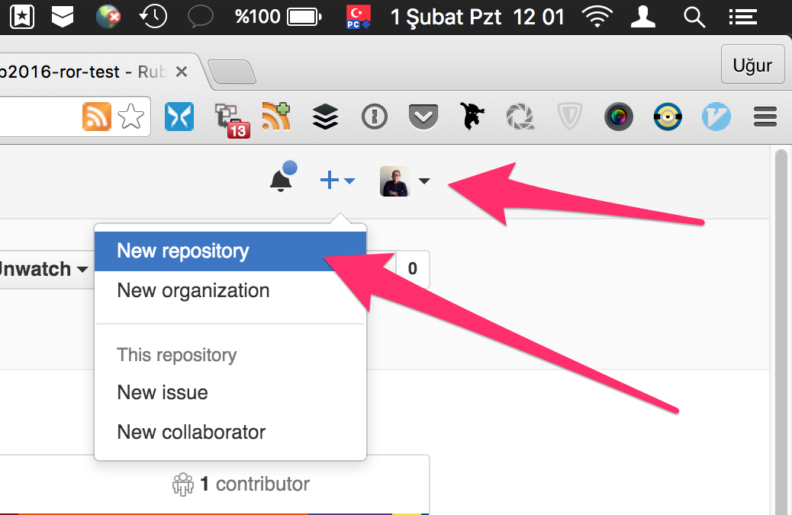

# Sunumlar

## Git

* [İnsanlar için GIT][11]
* [GIT 101 ya da 100][12]
* [GIT Flow][13]
* [GIT Flow Cheatsheet][14]

## GIT Flow - Demo

[](https://asciinema.org/a/35169)


## Command Line

* [BASH tips & tricks][21]
* [SEMVER - 1][22]
* [SEMVER - 2][23]

## Ruby

* [Ruby’i tanıyalım][31]
* [Ruby 101 kitap][32]

## Ruby on Rails

* [MVC - 1][41]
* [MVC - 2][42]
* [DAO][43]
* [ORM][44]

## Rails Uygulaması Oluştur ve GitHub’a Yolla

Öncelikle, sistemimizde git kullanıcısı oluşturmamız gerekiyor.

```bash
git config --global user.name  "ADINIZ SOYADINIZ"
git config --global user.email "eposta@adresiniz.com"
```

Daha sonra, [GitHub][github]’da hesabınıza gidip, **settings** kısmından,
**SSH KEYS** bölümünden makinenize ait **ssh-key**’inizi eklemiş olmanız
gerekiyor. Eğer key’iniz yoksa;

```bash
ssh-keygen -t rsa
```

ile oluşturup, burada oluşan key’i GitHub’a ekleyin:

```bash
# mac kullanıcıları
cat ~/.ssh/id_rsa.pub | pbcopy

# linux, copy/paste yapmak
cat ~/.ssh/id_rsa.pub
```

Copy/Paste ile bunu ekleyin...

  

  

  

Şimdi, kendi makinemizde repo açalım:

```bash
cd
rails new blog
cd blog/
rails generate scaffold Article title:string text:text
rake db:migrate

git add .
git commit -m "İlk kommit"
```

Şimdi GitHub’da yeni bir repo açalım:

  

  

  

Şimdi, varolan bir repo’ya remote eklemek için projenin
altında;

```bash
# xxxx/xxxxx.git = kendi adresinizi yazın!
# unutmayın, HTTPS ile başlayanı SEÇMEYİN!!!
git remote add origin git@github.com:xxxx/xxxxx.git
git push -u origin master

# ilk push’da -u kullanın,
# daha sonraki push’larda artık sadece;
#
# git push
#
# yapabilirsiniz...
```


[11]: https://speakerdeck.com/vigo/insanlar-icin-git
[12]: https://speakerdeck.com/webbox/git-101-ya-da-100
[13]: https://github.com/nvie/gitflow
[14]: http://danielkummer.github.io/git-flow-cheatsheet/index.tr_TR.html
[15]: https://asciinema.org/a/2h94vxekndm2ub2r2uen5k903

[21]: https://gist.github.com/vigo/4014521
[22]: http://kod.webbox.io/2014/08/28/semantik-versiyonlama-semver/
[23]: http://semver.org/lang/tr/

[31]: https://speakerdeck.com/vigo/rubyi-taniyalim
[32]: https://www.gitbook.com/book/vigo/ruby-101

[41]: http://www.sitepoint.com/getting-started-with-mvc/
[42]: https://en.wikibooks.org/wiki/Ruby_on_Rails/Getting_Started/Model-View-Controller
[43]: https://en.wikipedia.org/wiki/Data_access_object
[44]: https://en.wikipedia.org/wiki/Object-relational_mapping

[github]: https://github.com